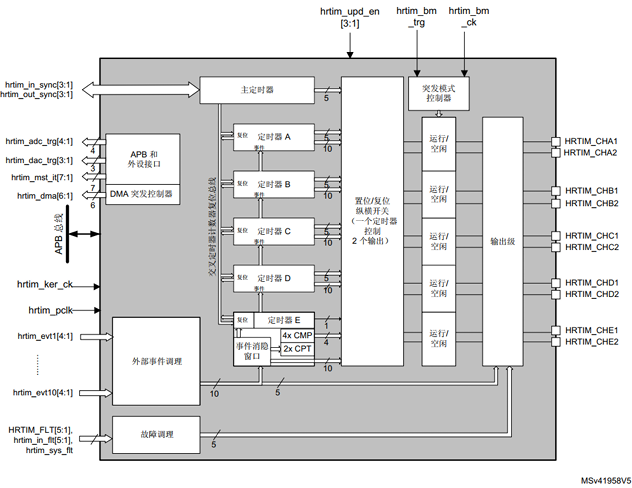
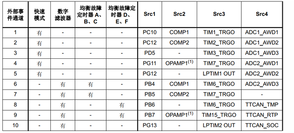
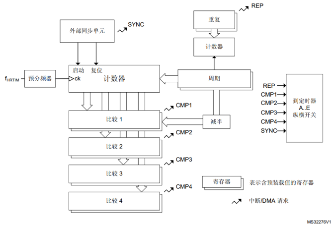
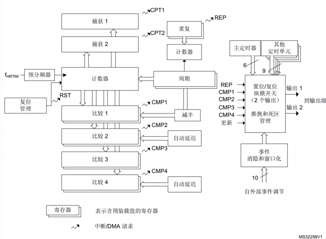
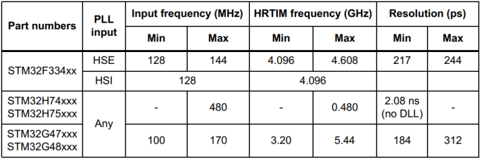

# HRTIM 简介

> 本部分仅限于 STM32F334，STM32H7 系列。

HRTIM，即高分辨率定时器（High-Resolution Timer）。

## 1. HRTIM 简介

### HRTIM 基本结构

1. 定时器

   **HRTIM 由 6 个定时器组成，分别是 1 个主定时器（Master Timer）和5个独立的定时器单元，从 Timer A 到 Timer E。**6 个定时器都是 16bit 定时器，每个定时器都包含 1 个独立计数器和 4 个比较单元。 

   - 主定时器

     基于 16 位递增计数器。它可通过 4 个比较单元置位/ 复位 10 路输出中的任何一路，并向 5 个定时器单元提供同步信号。其主要用途是使定时器单元受唯一的时钟源控制。

   - Timer A - Timer E

     既可以独立工作，也可以与其它定时器（包括主定时器）配合工作。每个定时器都可控制两路输出。输出置位/复位事件可以由定时单元比较寄存器触发，或者由主定时器事件、其他定时器的事件或外部事件触发。 

     > 每个定时器的两路输出支持：
     >
     > 1. PWM 互补输出，添加死区时间；
     > 2. 将载波频率添加到调制信号上；
     > 3. 通过将异步输出置为预定义的安全电平来管理故障事件。

2. 外部事件

   可编程极性和边沿有效性。 

   5 个事件用于快速异步模式。 

   5 个事件用于可编程数字滤波器。

   利用消隐和窗口模式实现伪事件过滤。

3. 多条通道可连接到内置模拟外设

   4 个用于 ADC 转换器的触发信号。

   3 个用于 DAC 转换器的触发信号。

   3 个用于比较器。

4. 保护机制

   5 路故障输入可组合使用，而且可以关联到任何定时单元。

   可编程极性和边沿有效性。

   对谐振变换器配有专门的延时保护。

### HRTIM 框图

> - `hrtim_in_sync[3:1] `：同步输入端，将HRTIM与其他内部或外部定时器资源进行同步输入。
>
>   `hrtim_in_sync[1]`：保留。 
>   `hrtim_in_sync[2]`：时钟源为通用 TIMx 定时器（通过片上互连）。 
>   `hrtim_in_sync[3]`：时钟源为外部 HRTIM（通过 `HRTIM_SCIN` 输入引脚）。
>
> - `hrtim_out_sync[2:1]`：同步输出端，用于级联或同步多个片上或片外 HRTIM。
>
>   `hrtim_out_sync[1]`：保留。 
>   `hrtim_out_sync[2]`：目标为片外 HRTIM 或外设（通过 `HRTIM_SCOUT` 输出引脚）。 
>
> - `hrtim_adc_trg[4:1]`：输出端，用于触发 ADC 转换。
>
> - `hrtim_dac_trg[3:1]`：输出端，用于触发 DAC 转换。
>
> - `hrtim_mst_it[7:1]`：输出端，用于发出中断请求。 
>
> - `hrtim_dma[6:1]`：输出端，用于发出 DMA 请求。 
>
> - `hrtim_pclk`：输入端，APB 时钟。 
>
> - `hrtim_ker_ck`：输出端，HRTIM 内核时钟。
>
> - `hrtim_evtX[4:1]`（X 的范围是 1 到 10）：
>
> - 输入端，用于接收外部事件，支持接收 10 个事件，每个事件有4种输入源可以选择，可选择片上（来自其他内置外设：比较器、ADC 模拟看门狗、TIMx 定时器、触发输出等）或片外（`HRTIM_EEVx` 输入引脚）。
>
>   
>
> - `hrtim_in_flt[5:1]`：故障输入端，5 路片上输入和 5 路片外 `HRTIM_FLTx` 输入。 
>   当输入信号有效时立即禁止 HRTIM 输出。 
>
> - `hrtim_sys_flt`： 系统故障输入，比如时钟安全系统，SRAM 奇偶校验错误，Cortex-M7 LOCKUP (HardFault)，PVD 输出等。 
>
> - `hrtim_upd_en[3:1]`：输入端，HRTIM 寄存器更新使能（片上互连）会触发从影子寄存器到活动寄存器的传输。 
>
> - `hrtim_bm_trg`：输入端，突发模式触发事件。 
>
> - `hrtim_bm_ck`：输入端，突发模式时钟。

### HRTIM 特性

1. 时钟选择

   HRTIM 支持两种时钟输入，一个是通用定时器时钟输入，另一个是 CPU 主频时钟输入。

2. 主定时器

   

   > 1. 主定时器有 1 个计数器，4 个比较单元，但没有捕获单元和输出。
   > 2. 主定时器的控制寄存器包含主定时器 Master Timer 和定时单元 Timer A 到 E 的所有定时器使能位。

3. Timer A - Timer E

   

   > 1. 有 1 个计数器，4 个比较单元，2 个捕获单元，带两个输出。
   > 2. 比较单元 2 和比较单元 4 支持自带延迟。
   > 3. 事件消隐和窗口模式可以实现伪事件过滤。
   > 4. REP，CMP1，CMP2，CMP3，CMP 和定时器更新这几个信号可以设置输出端的置位/复位。

4. 分辨率

   STM32H7 的主频配置为 400MHz 时，那么 HRTIM 的时钟最高就是 400MHz。对于 H7 系列，HRTIM 不支持倍频设置，仅支持 1 分频，2 分频和 4 分频。

   

## 2. HRTIM 的配置

