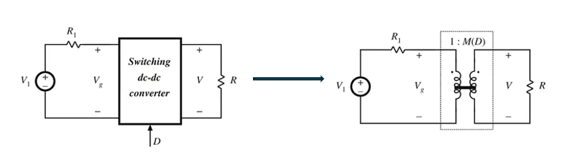
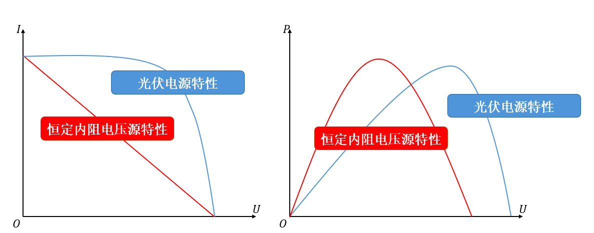
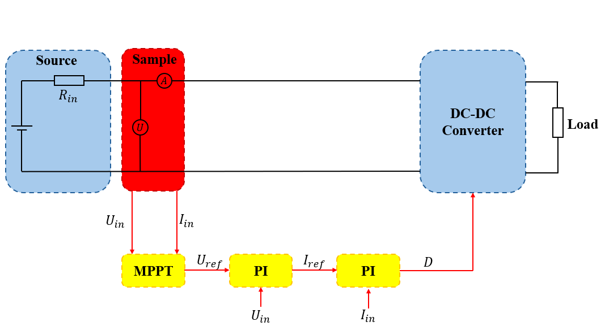
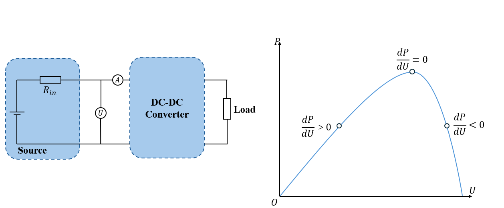
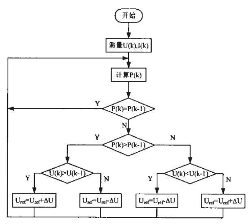
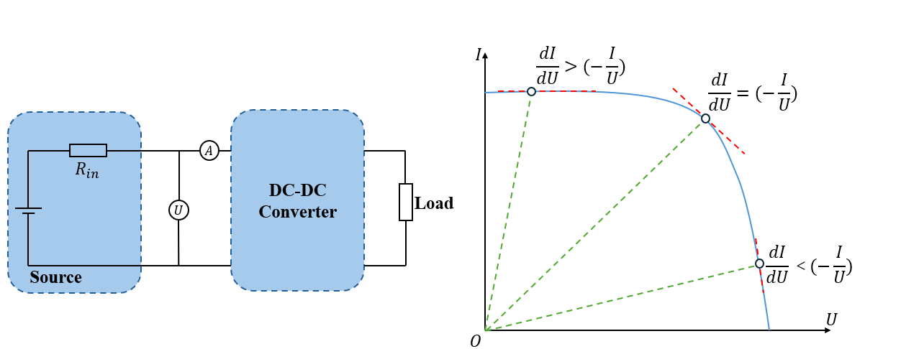
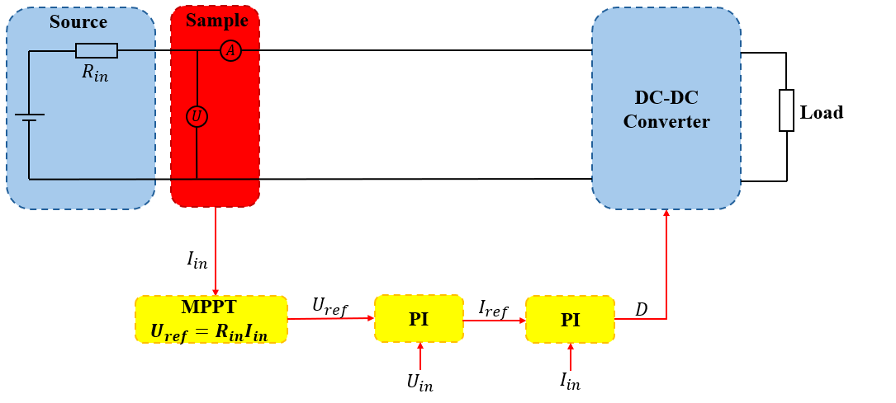
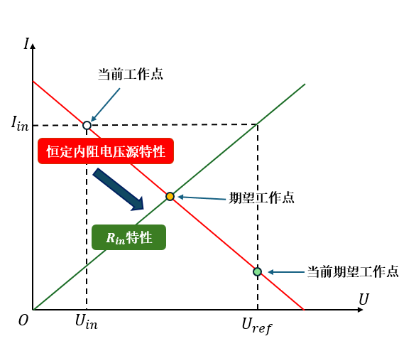

# MPPT 算法

MPPT （Maximum Power Point Tracking） 即为最大功率点跟踪算法。通过控制电源的工作电压或者工作电流，让电源工作在最大功率点，即总是让电源输出最大功率。

## 1. DC-DC 电路能够实现 MPPT 的基本原理

[参考链接](https://www.bilibili.com/video/BV1vX4y1s78w/?spm_id_from=333.337.search-card.all.click&vd_source=2d2507d13250e2545de99f3c552af296)

DC-DC 电路总是能等效为一个直流变压器模型，折算到电源一侧的等效负载为$\frac{R}{M^2(D)}$。此时控制$D$就能控制等效负载，从而控制电源的输出工作点。**由最大功率传输定理，等效负载等于电源内阻时，输出的功率最大。**因此，DC-DC 电路能够实现 MPPT。

## 2. MPPT 的算法实现

光伏电源和带内阻电源的伏安特性和输出功率特性如下，从伏安特性上看，恒定内阻电源的内阻是固定的，但是光伏电源的内阻是变化的；从功率曲线上看，电源的功率曲线都是一个单峰的曲线，因此可以用相似的方法进行 MPPT。

通常根据 P-U 曲线进行 MPPT，分为**扰动观察法**和由此衍生的**电导增量法**。

使用 MPPT 的 DC-DC 电路工作框图如下，通常根据检测到的数据生成一个参考电压指令，将电压指令送入 DC-DC 的控制环路进行控制。

当然，如果已知了电源的伏安特性，可以离线求出最大功率点 $U_{ref}$ 的集合，根据当前的条件确定 $U_{ref}$，也可以实现最大功率点跟踪，称为**固定电压法**，但是该方法对参数十分敏感，不推荐使用。 

### 扰动观察法

根据电源的功率曲线是一个单峰的曲线，可以采用以下的 MPPT 方式：
$$
\left\{
\begin{aligned}
U_{ref} = U_{ref}+\Delta U ; \frac{dP}{dU} \geq 0  \\
U_{ref} = U_{ref}; \frac{dP}{dU} = 0 \\
U_{ref} = U_{ref}-\Delta U ; \frac{dP}{dU} \leq 0
\end{aligned}
\right.
$$

扰动观察法的频率不宜太高，1Hz-200Hz为宜，需要等待稳态过程。

### 电导增量法

$P=UI$，对 $U$ 求导可得：
$$
\frac{dP}{dU} = I + U\frac{dI}{dU}
$$
代入扰动观察法的公式，可以得到电导增量法：

$$
\left\{
\begin{aligned}
U_{ref} = U_{ref}+\Delta U ; \frac{dI}{dU} \geq -\frac{I}{U}  \\
U_{ref} = U_{ref}; \frac{dI}{dU} = -\frac{I}{U} \\
U_{ref} = U_{ref}-\Delta U ; \frac{dI}{dU} \leq -\frac{I}{U}
\end{aligned}
\right.
$$

> 对于恒定内阻电源，$\frac{dI}{dU} = \frac{1}{R_{in}}$，使用电导增量法的计算速度会非常快。

- 变步长的方式

  在电导增量法中，每次检测到工作点后，执行的动作总是定步长的 $\Delta U$。接下来介绍一种能够适用于恒定内阻电源的变步长方式。

  

  如下图，每次动作时，$U_{ref} = R_{in}I_{in}$，这样会导致以下的结果。

  

  

  

