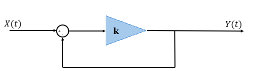
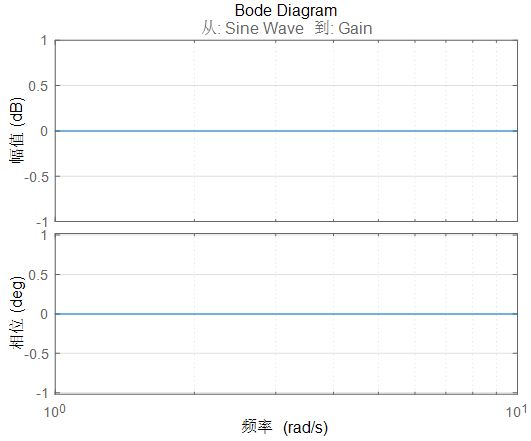
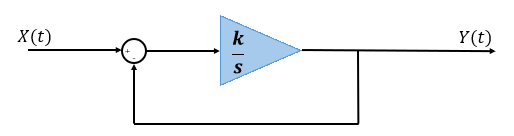
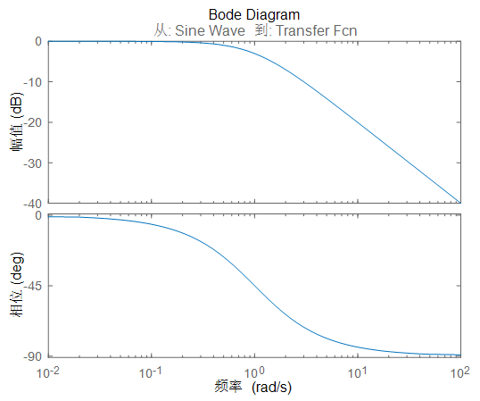
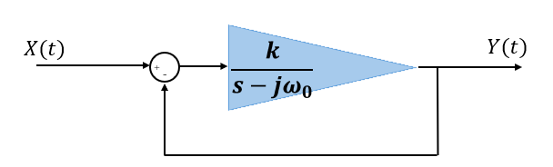
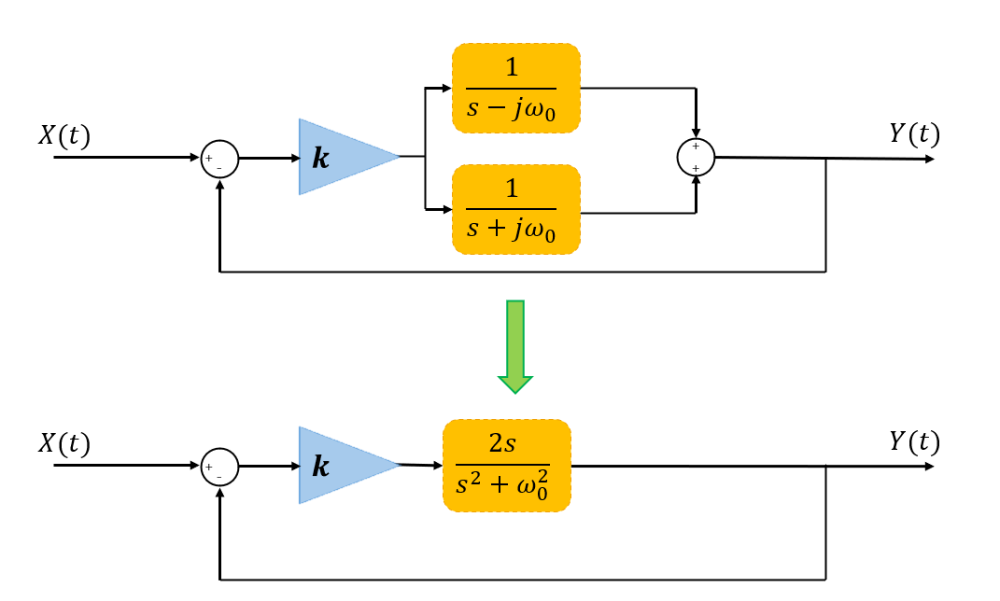
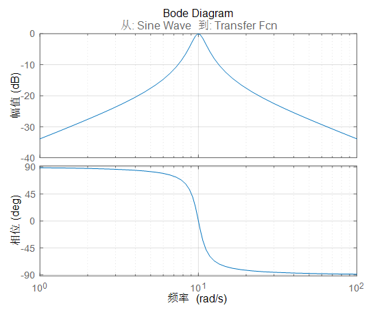
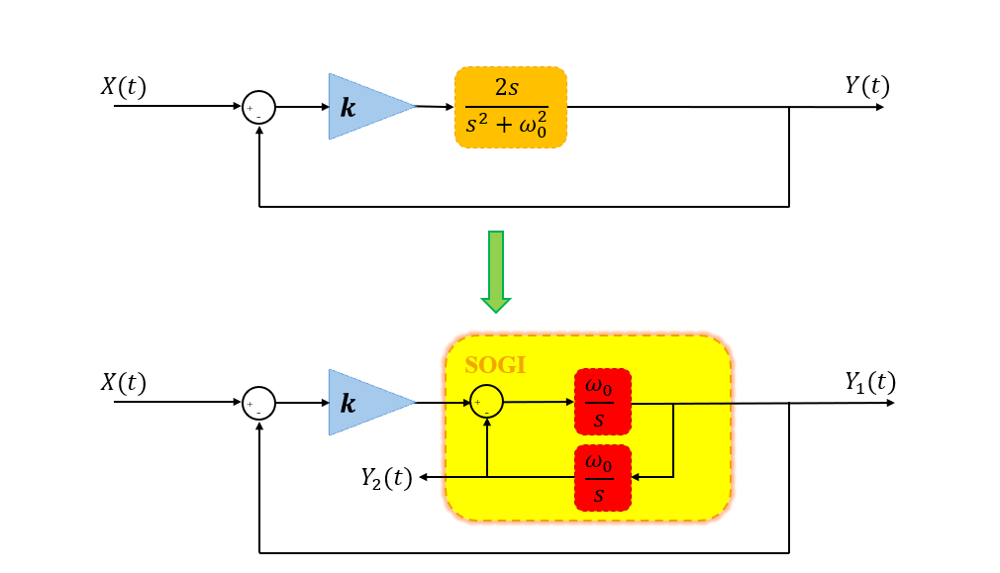

# SOGI 算法

## 1. SOGI 的由来

先从以下的系统开始说明 SOGI 的构成：

这个系统的开环传递函数为：
$$
G(s) = k
$$
这个系统的闭环传递函数为：
$$
G(s) = \frac{k}{1+k}
$$
$k$ 取无穷大时，开环增益极大，闭环增益趋近于1，由于不改变相频特性，基本上等同于直通。

如果将增益环节 $k$ 替换为带增益的积分环节 $\frac{k}{s}$：

在开环环节看来，积分作用于直流信号时会无限制增加直流信号的幅值，而对于交流信号，幅值会做$\frac{1}{\omega}$ 的衰减（$\omega<1$ 仍视为伪直流信号）。

在闭环环节看来，系统的闭环传递函数为$G(s) = \frac{k}{s+k}$，幅频特性上，当 $\omega = 0$ 时的闭环增益为 1，而交流信号输入的幅值存在衰减，达到了选频的效果。

实际上，如果要针对 $\omega_0$ 实现选频，可以构造如下的系统：

在闭环环节看来，系统的闭环传递函数为$G(s) = \frac{k}{s-j\omega_0+k}$，幅频特性上，当 $\omega = \omega_0$ 时的闭环增益为 1，而交流信号输入的幅值存在衰减，达到了选频的效果。

但是上述系统在数字实现中很不好实现(因为无法很好的表示虚数)，一般会使用以下的手段将虚数项消掉：

此时系统的闭环传递函数为$G(s) = \frac{2ks}{{s^2}+2ks+\omega_0^2}$，其幅频特性如下：

可以看到，在选定的频率条件下是全通的且不发生相移，实现了良好的选频特性。

## 2. 二阶广义积分器 SOGI

SOGI 可以用于选频(且不发生相移)，而且对系统进行适当变换，可以用于发生正交信号。

闭环传递函数：
$$
G_1(s) = \frac{k\omega_0s}{s^2+k\omega_0s+\omega_0^2} \\
G_2(s) = \frac{k\omega_0^2}{s^2+k\omega_0s+\omega_0^2}
$$
$Y_1(t)$ 和 $Y_2(t)$ 有 90° 的相位差。
