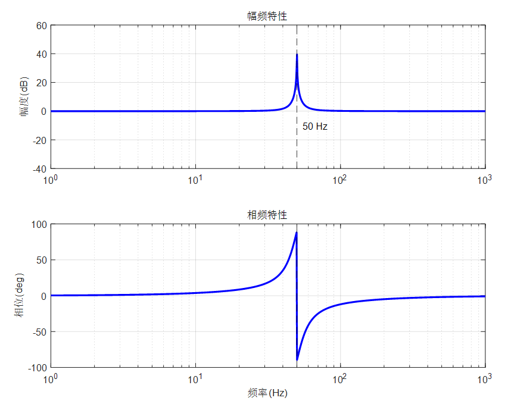

# 单相逆变器离网闭环控制

单相逆变器开环拓扑：

通常使用 SPWM 进行调制：

开环系统框图如图所示：

## 1. PI 控制器闭环控制

一个最基础的做法是使用电压PI控制器闭环控制：

或者使用电压外环PI+电感电流内环PI控制器控制：

但是，在调参过程中，会发现：无论参数如何，稳态下的逆变器输出电压幅值总是低于指令电压幅值。这是因为 **PI 控制器无法使得系统无静差跟踪正弦量导致的**。

PI 控制器的传递函数如下：
$$
G_{PI} = Kp + \frac{K_I}{s}
$$
根据**内模原理：跟踪控制器的选择必须稳定闭环系统且包含参考信号的模型。**可以得到：PI 控制器无法无静差跟踪正弦量，因为正弦量的 Laplace 变换为：$\frac{s}{s^2+\omega_0^2}$。

由此存在两种改进方式：

> 1. 采用有效值 PI 控制；
> 2. 采用瞬时值 PR 控制。

## 2. PR 控制器闭环控制

PR 控制器包含了参考正弦信号的模型，其传递函数如下：
$$
G_{PR} = K_p + \frac{K_rs}{s^2+\omega_0^2}
$$
PR 控制器在 $\omega_0$ 处的增益接近于无限大，在其他频率下增益低，能够有效地抑制扰动信号。可以把PR 控制器看作带宽极窄的二阶带通滤波器。

理想的 PR 控制器是完全可以实现对应频率的交流量实现无静差跟踪的，但是在谐振频率附近的频段带宽过于狭窄，而在 $\omega_0$ 处的增益过高，会使得系统的稳定性不够，当交流信号发生些许偏移时，PR控制器就无法精准工作在预设频率上了，虽然可以通过调节 $K_r$ 增大带宽，但是会使得增益变化和相位变化明显增大，会造成系统不稳定。

PR 控制器的改进形式是准 PR 控制器，用于抵抗频率干扰：
$$
G_{PR} = K_p + \frac{2K_r\omega_cs}{s^2+2\omega_cs+\omega_0^2}
$$
当输入信号频率为 $\omega_0$ 时，增益为 $K_p+K_r$，不再像 PR 控制器那样增益无穷大。

> 准 PR 控制器调参：
>
> 1. 当 $K_p$ 增大，整体增益随之增大，加入 $K_p$ 是为了调节系统的动态性能；
> 2. 当 $K_p$ 和 $\omega_c$ 相同时，控制器的增益随 $K_r$ 增大而增大，而谐振频率附近的带宽也有所增加，所以调节 $K_r$ 使得准 PR 控制器有足够大的增益，实现零稳态误差；
> 3. 当 $K_p$ 和 $K_r$ 相同时，增加 $\omega_c$ 可以提升带宽，加快响应速度，但是可能会引入高频噪声；
> 4. $\omega_0$ 选择参考信号频率。

因此，单相逆变器的控制框图如下：

