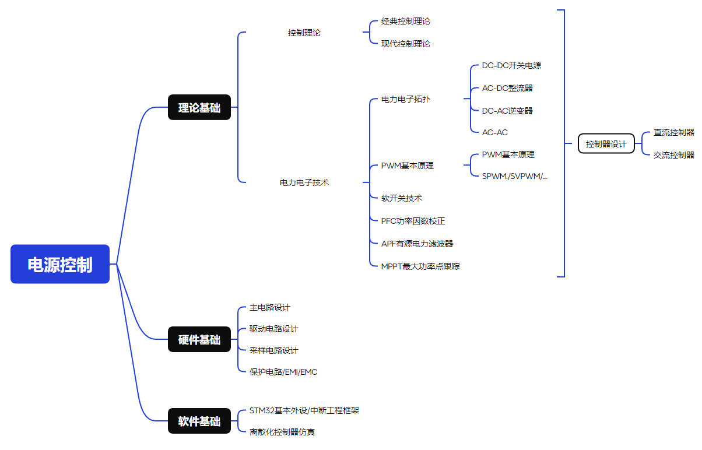

# Power

电源/电力电子学习笔记。

## 本库的使用方法

本库是电力电子驱动的笔记合集，适用于学习STM32的基础驱动后进行学习。

部分内容参考 Engine。

电机驱动笔记：[Click Here](https://github.com/SSC202/Engine)

### 使用此库的前置条件



### 文件夹结构

```
.
|--	Note	// 笔记
|-- Code 	// 测试例程,每一个例程包括软件文件夹Code和硬件设计原理图
|-- Project	// 测试工程
|-- Mode	// 控制仿真
```

